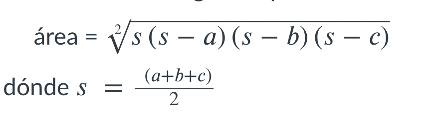

# Area 

Modifica el programa que se encuentra en la carpeta `src` que se llama `exercise.py` y que contiene el siguiente código:

```python
def main():
    #escribe tu código abajo de esta línea
    #Desarrolla un programa en Python que calcule la distancia entre dos puntos del plano cartesiano.
    #Los mensajes para recibir las 4 entradas deben ser **"x1=    y1=     x2=   y2=   ** respectivamente "
    #El mensaje para la salida debe ser **"distancia= **"


if __name__ == '__main__':
    main()
```

La línea `#escribe tu código abajo de esta línea` es un comentario, el programa la va a ignorar al ejecutarse.

## Definición del problema

Desarrolla un programa en Python que calcule el area de un triángulo cuyos lados son : 
a, b y c.

## **Entradas**

El programa solicita los lados a, b y c.  
Todos enteros y en ese orden.

## **Salida** 

El área del triangulo calculada con la siguiente fórmula



## Ejemplos de ejecución

Ejemplo 1 

```plaintext
Ingresa lado a : 3
Ingresa lado b : 25
Ingresa lado c : 26
área = 36.0
```

Ejemplo 2 

```plaintext
Ingresa lado a : 10
Ingresa lado b : 12
Ingresa lado c : 15
área = 59.81168364124187
```
**Nota:** No te preocupes por esta parte del código `if __name__ == '__main__':` por el momento. No la vamos a necesitar para este programa, pero es una buena práctica incluirla y quedará más claro para que sirve en los siguientes ejercicios.

Una vez que termines tu actividad y la hayas probado con `pytest`, súbela a tu repositorio en GitHub, con el proceso de commit + push.
